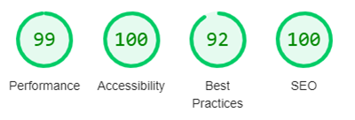
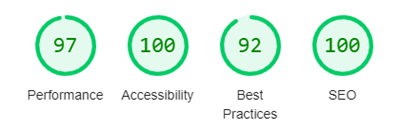
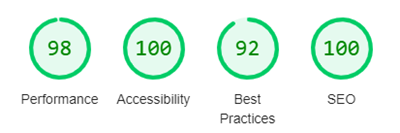
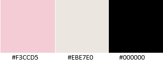
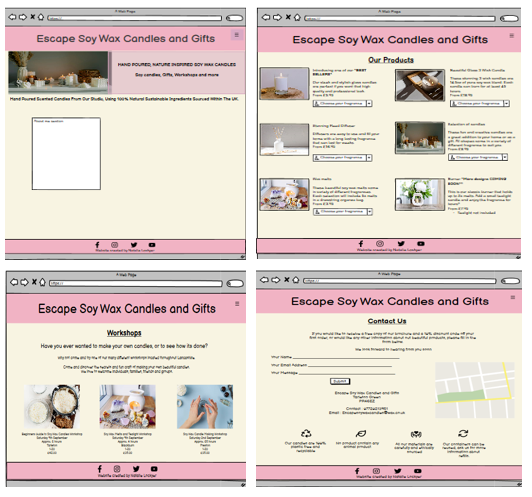
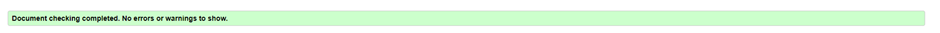

# Escape Soy Wax Candles and Gifts

Escape Soy Wax Candles and Gifts is a website that is designed to attract any consumer with a love of natural soy wax candles, buying gifts/gift ideas and interactive workshops. This website showcases beautiful images and detailed descriptions of the products available to them and the workshops that are planned for future dates. There is also a “contact us” page, if they required any further information, or would simply like to sign up for a free brochure and discount code off their first order, all of which are useful to the target audience in order to decide as to whether they would like to purchase a gift or workshop package. 

## Contents

### User Experience

### Design Features
* Header and Navigation
* Main Section Homepage
* Footer
* Our Products Page
* Workshop Page
* Contact Us Page
* Future Features
* Accessibility
* Colour Scheme
* Typography
* Wireframes

### Technologies Used
* Languages Used
* Frameworks Used

### Deployment and Local Deployment
* Deployment 
* Local Deployment

### Testing
* W3C Validator
* Bugs
* Full Testing

### Credits 

## User Experience (UX)

### Client Goals

* For their users to be able to view the site on a range of different size devices.
*	Potential users to know exactly what the website is about and can navigate easily through the website. 
*	An eye-catching display that makes the client want to return.
*	Allow clients to contact the company if they want any other information.

### First time visitor goals 

*	As a new visitor, I want to easily understand the main purpose of the site and what it has to offer.
*	I want to be able to navigate around with ease, using shortcuts if available.
*	I want to know what products are available and what workshops are on offer.
*	I also want to be able to find their social media links.

### As a returning visitor

*	I want to follow for new products or workshops that are taking place.
*	I want to be able to contact the company with any questions or orders I may have.

### As a frequent visitor

*	I want to be able to recommend this site to friends and family, or other users.
*	I want to see if there are any offers or new products. 

## Design Features

The website is made up of 4 pages, the Homepage, Our Products, Workshops and a Contact Us page.

### - Navigation / Header

Featured of all four pages, The navigation bar is situated at the top of the page. In the top left corner is the shorthand name of the company. Once clicked on any of the website pages, this will return the user to the top of the homepage. 
The other navigation links are in the top right corner of the page. For our smaller devices (768px and below) the user will see a stackable menu (burger menu) in the right hand corner of the page. When the user clicks on this, a drop down menu will appear listing Homepage, Our Products, Workshops and a Contact Us page. Each link will navigate the user to the correct page. 

For our larger devices (768px and above) the user will see the navigation menu display horizontally at the top of the page.

The navigation has been styled with bakground colour #f3ccd5, the font-family is Amiri and font colour is #000000 which all contrast together nicely. The navigation clearly explains to the user the shorthand name of the company and the different sections within the website making this easy for the user to navigate round.

### Main Section (Homepage)
  The main section is seperated into three parts.  

The first section contains a heading with the name of the company. This is clear and is in a slightly different style to the              navigation bar as to stand out to the user. This heading is used on all four pages of the website and continues the continuity of the     site. The font-style is in oblique and has a font-weight of 700.

The second section contains and image and a caption providing clear information about what the company does and where they source        their materials. The image is to entise the user in and want to look further.

The third section contains an 'about me' and image. The about me gives potential customers an insight as to how the company started,      the passion that has gone into creating the company and hopes to build strong connections with the users.

The main section has been styled with the same font-family, all have been centerally aligned. 

### Footer

Featured on all for four pages, The footer is located at the bottom of the webpage. The footer includes links to Facebook, Instagram, Twitter and Youtube sites for Escape. These links all open on to a new tab. These links are great for encouraging the user to view our site via other social media outlets. 

### Our Products Page

The product page contains images and descriptions of the products that are for sale. As part of the description you can see how much the candles/items sell for and what frangrances are available, this is shown in a drop down menu underneath each description. 
This section is valuble to the user as they can see what products are available to them.

### Workshop Page

The workshop page contains images and descpitions of the interactive courses that are available to the user. Each course details the date, approx length of the course, where is it located, the maximum number of people that can attend and the price of the course. This is all important information for the user. Each detail has an icon at the beginning, this provides an easy and effective way to add a visual emphasis for each item. 

### Contact Page

The contact page is an interactive way were the user can make contact with the team. Whether that is for further infomation or to request a free brochure and discount code. The user is required to add their first name, last name and email address, if anything is missing the form will not send.
Here there is also a contact address, number and google map to show the user where the headquarters for the company is. 
There are also some icons and descriptions of how the company complies with recycling / animal friendly procucts and reusing products,  which in our current climate of working together to bring the levels of global warning down, is important for the user to see. 

### Future Features

* A slideshow of images on the homepage to showcase what we have to offer, to enhance the expirence for the user and increase interest in the page.
* Add reviews from previous clients

### Accessibility

I have run the webpage through Lighthouse on developer tools, these were the results.

* Homepage

* Our Products

* Workshops 

* Contact Us

### Colour Scheme

These are the colours I chose for the theme, I think the pink and beige compliment each other whilst the black text used for the font stands out.

### Typography 

I used Google Fonts for my font style. 
For the Main heading I used 'Amiri'
For all other text I used 'IBM Plex Sands'

### Wireframes

For my wireframes I used Balsamiq. This was the first time I has used this programme, and after speaking with my mentor, I realise now that the detail I put into it was to much. I have learnt from this and will reduce how much I include next time, I will also add other size devices to test out my ideas. 

## Technologies Used

### Languages Used 
* HTML
* CSS

### Frameworks Used 
* Balsamiq - Used to create wireframes
* Codeanywhere - Used to save and store files
* GitHub - Used for version control
* GitPod - Used to save and store files
* Google Fonts - Used to import fonts
* Font awesome - Used to import icons
* Chrome Dev Tools  - Used to test my features and to solve issues
* Favicon - Used to upload favicon

## Deployment and Local Depyloyment

This website was deployed to GitHub pages. The steps to deploy this pageto GitHub from its Github repository is as follows:

### Deployment 

* Login to Github
* Open the repository
* Navigate to the settings tab
* Click on 'Pages' in the left hand column
* Under 'Source' select 'Deploy from branch'
* Under 'Branch' select 'main', 'root' and save. This step may take a little time to  process.
* Once completed, the URL will appear above 'source'.

### Local Deployment

How to Fork 
* Login to Github
* Open repository
* Click fork button in the top right corner.

How to clone 
* Login to Github
* Open repository 
* Click on the 'code' button, select which you would like with HTTPS, SSH or GitHib CLI and copy
* Open terminal in code editor and change the current directory to the location you want to use is
* Type 'git clone' and paste link that you copied in step 3, press enter

## Testing

Throughout the build, I was constanly testing the website. I used Chrome developer tools to troubleshoot any issues I was having. 

The following issue were raised at my mid project meeting with my mentor:

* The font size was in px and was reccomended that I use rem.
* Some of my file names were not consistant.
* I had used a lot of ID's and some of these could be changed to a class.
* A color-variable was suggested.

The following items were brought up when I submitted my website to peer code review on Slack:

* On 'Workshop' page, use letter spacing so the text doesnt looked as cramped.
* Page title was a paragraph instead of a 'heading.
* on 'Contact' page the map was partly off the screen and not centered.
* Checked spacing of events as they look a little squashed.

## W3C Validator

I used the W3C Validator to validate the HTML on all pages of the website. I also used CSS Validator to validate the CSS style.css file, i had the following results:

Index Page

Our Products Page

Workshop Page 

Contact Us Page

Style.css Page

## Full Testing

In order to fully test the responsiveness of my website, I performed the following testing on a number of browsers and devices, these being 
* Browsers 
  - Google Chrome, Firefox and Safari.

* Devices 
  - Redmi 10, Redmi Note 11 pro 5G, Iphone 13, 
  - iPad, iPad mini, iPad Pro, 

1. Test each link on the 'index page'. Each link worked as it should. Links leading to external pages also opened correctly on a new browser tab. 
2. Test each link on the 'Our Products' page. Each link worked as it should. Links leading to external pages also opened correctly on a new browser tab.
3. Test each link on the 'Workshop' page. Each link worked as it should. Links leading to external pages also opened correctly on a new browser tab.
4. Test each link on the 'Contact Us' page. Each link worked as it should. Links leading to external pages also opened correctly on a new browser tab.

Contact Us form 
 - The form is working as expected. All of the inputs have been tested and all are required before this can be submitted. 
 - The email must contain @ symbol. 
 - I have tried submitting the form without any information, the form directs the user to fill in the name field, and so on. 

### Bugs

Issue with menu (burger menu) not displaying in the Nav Bar
* Spoke with tutor, I hadnt added the font awesome script link to the header. This issue was resolved

Issue pushing the footer to the bottom
* This was an issue with the position. This issue was resolved

Issue with CodeAnyWhere not saving my changed
* After a period of time and speaking with tutor I logged out and back in again. The issue was resolved.

Issue with 'Main' sitting half way up the page
* Spoke with tutor, this was an overflow issue. The issue is now resolved. 

### Credits 

### Content
* All Content was written by myself
* The text throughout the website was taken from Google Fonts.
*	The icons throughout the website was taken from Fontawesome
*	The icon used for the favicon was taken from Flaticon, and I used Favicon to convert the image to a favicon.
* If I needed any assistance with coding, I firstly would google the issue to see if it was something simple that I was missing, I would then look to W3Schools and then reach out on Slack to my fellow students. If all this failed I then contacted the Code Insitute Tutors. 
* When creating the drop down menu, I used the Code Institue slide (in particular the coders coffeehouse slides) to assist me. 
* When creating the form, I used the Code Institute slides (in particular the love running slide) to assist me.  

### Media
*	The images used throughout the website were taken from Pexels, iStockphoto, Freepik and Unsplash
*	The map on the contact us page was taken from Google Maps. 

